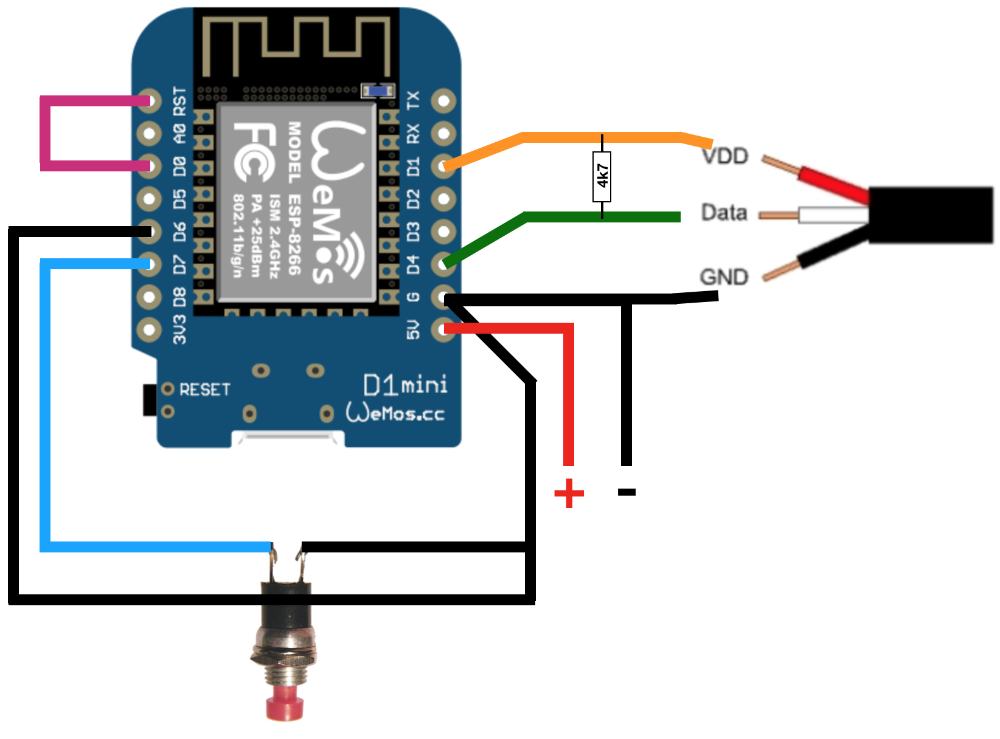
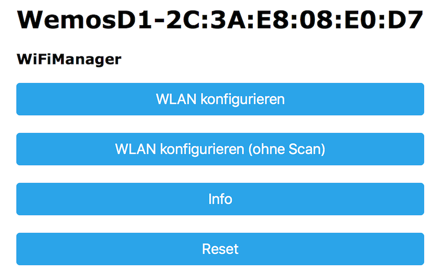
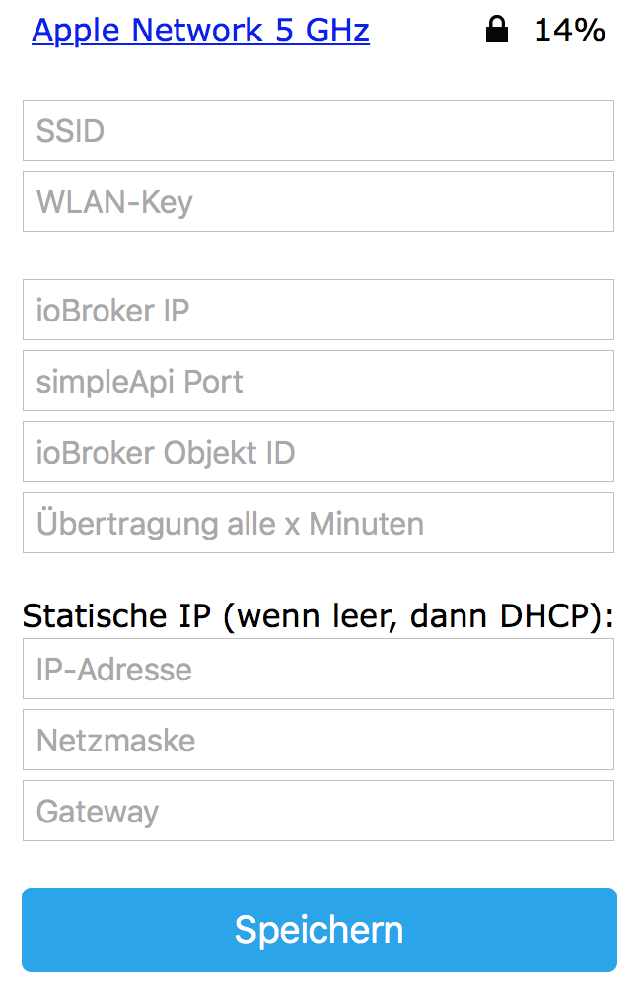
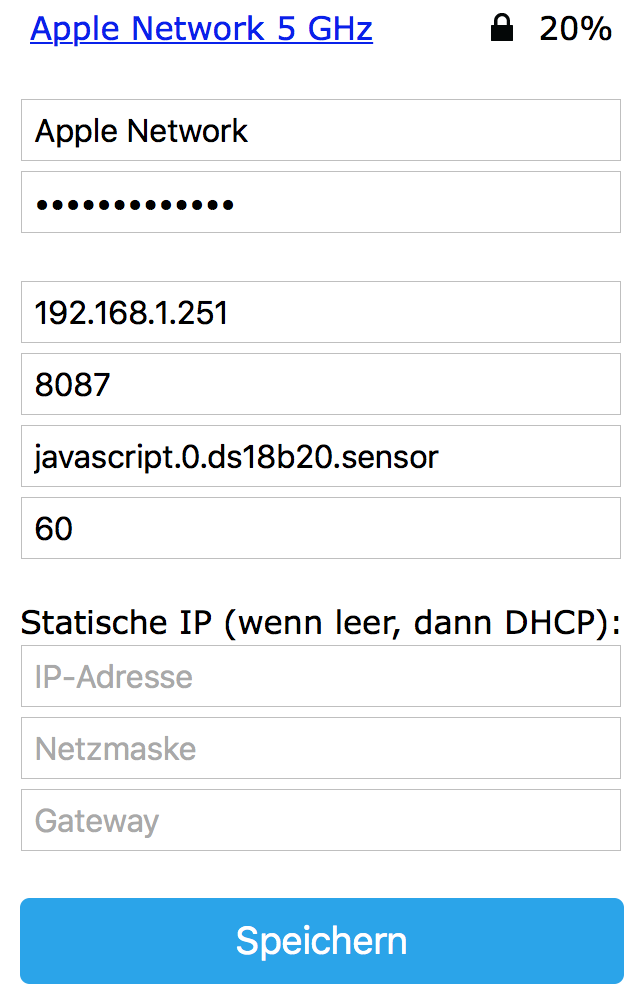

# Wemos D1 als ioBroker Temperatursensor  

## Folgende Bauteile werden benötigt:
- Wemos D1 Mini
- DS18B20 Sensor
- 1 Taster (nicht dauerhaft, nur um bei erster Inbetriebnahme / Änderungen den Konfigurationsmodus zu starten)
- Stromversorgung (z.B. ein Batteriehalter mit 3x AA Batterien)


Anschluss eines DS18B20 Sensors

**Es können mehrere DS18B20 Temperaturfühler sternförmig angeschlossen werden!**

## Flashen
Wenn alles nach obigem Bild verdrahtet wurde, kann das Image ```WemosD1_ioBroker_DS18B20.ino.d1_mini.bin``` auf den Wemos geflasht werden.

**Hinweis: Der Flash-Vorgang funktioniert nur ohne Brücke zwischen D0/RST. Diese ist daher bestenfalls erst nach dem Flashen einzulöten** 

#### Vorgehensweise:
1. Voraussetzungen:
  - CH340-Treiber installieren
  - esptool 
    - für [Windows](https://github.com/thekikz/esptool/blob/master/esptool.exe) herunterladen
    - oder plattformunabhängig das Python Package [esptool](https://pypi.python.org/pypi/esptool/)
2. WemosD1 mit einem microUSB-Kabel an den PC anschließen
3. Bezeichnung des neuen COM-Ports im Gerätemanager notieren (z.B. COM5)
4. Flash-Vorgang durchführen: 

  ```esptool.exe -vv -cd nodemcu -cb 921600 -cp COM5 -ca 0x00000 -cf WemosD1_ioBroker_DS18B20.ino.d1_mini.bin```

## Voraussetzungen: 
- installierter simpleAPI Adapter in ioBroker
- angelegte ObjektIDs je nach Anzahl der angeschlossenen Sensoren

## Konfiguration des Wemos D1
Um den Konfigurationsmodus zu starten, muss der Wemos D1 mit gedrückt gehaltenem Taster gestartet werden.
Die blaue LED blinkt kurz und leuchtet dann dauerhaft. 

Der Konfigurationsmodus ist nun aktiv.

Auf dem Handy oder Notebook sucht man nun nach neuen WLAN Netzen in der Umgebung. 

Es erscheint ein neues WLAN mit dem Namen "WemosD1-xx:xx:xx:xx:xx:xx"

Nachdem man sich mit diesem verbunden hat, öffnet sich automatisch das Konfigurationsportal.

Geschieht dies nicht nach ein paar Sekunden, ist im Browser die Seite http://192.168.4.1 aufzurufen.



**WLAN konfigurieren auswählen**



**SSID**: WLAN aus der Liste auswählen, oder SSID manuell eingeben

**WLAN-Key**: WLAN Passwort

**ioBroker IP**: selbsterklärend

**simpleApi Port**: meist 8087

**Übertragung alle x Minuten**: Sende-Intervall. Zwischen den Übertragungen verbleibt der Wemos D1 im DeepSleep Modus, um Energie zu sparen. Je größer die Sendeabstände, desto länger ist die Lebensdauer der Batterien



**Beispiel**

#### Nach dem "Speichern" startet der Wemos neu und es findet eine Übertragung der Werte an ioBroker statt.


